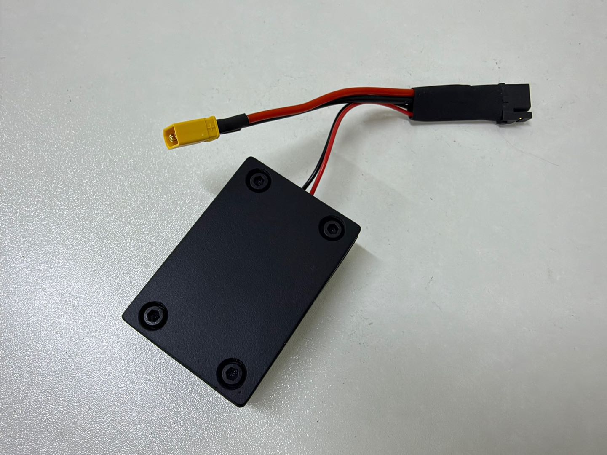
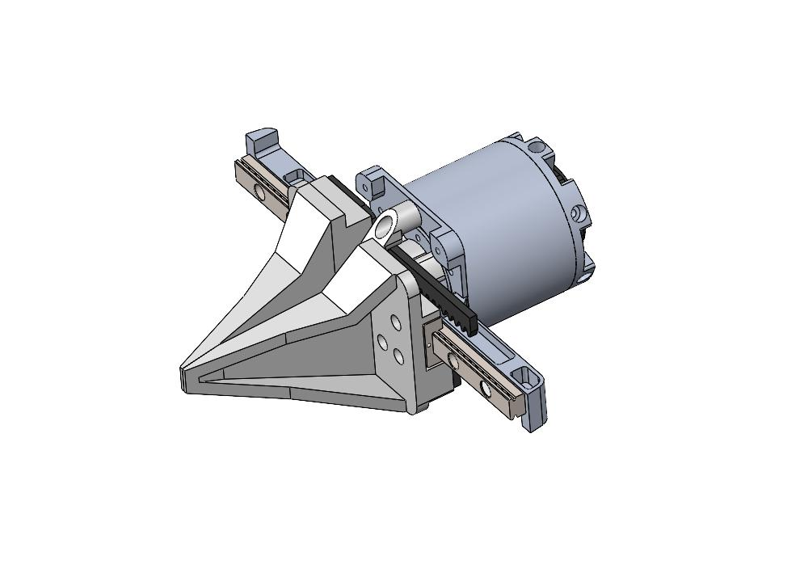
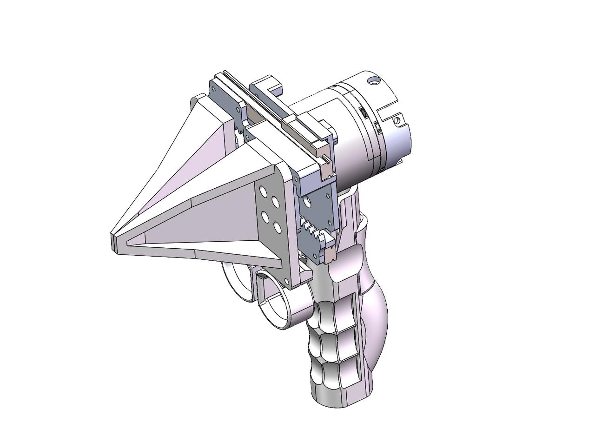

V2.0仅适配无保护CAN板

X5文件夹为python SDK

启动时注意区分版本来启动对应launch

具体参考00-readme文件夹

| 型号            |                 | 示意图                                            | 区别         |
| --------------- | ------------------- | ------------------------------------------------- | ------------ |
| X5（2023）      | 标准单臂        |  | 单轨二指夹爪 |
| X5（2025）  | AC one上机械臂  |  | 双轨二指夹爪 |
